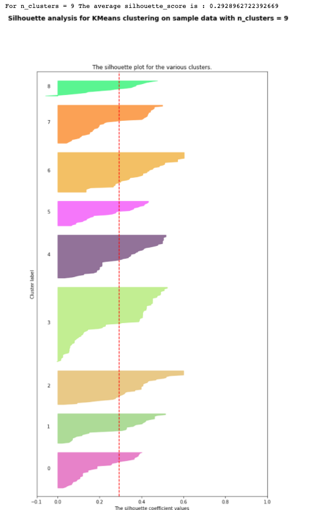
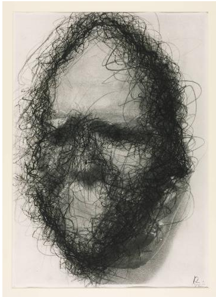
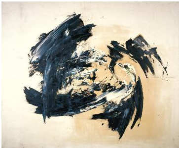
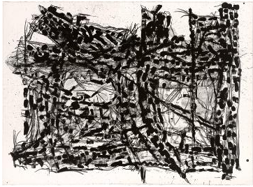
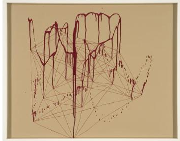

# Museum Collections Clustering

## Iteration I
### Varaibles
- has_text: indicator that the work contains text
- kinetic: indicates the work moves or has movement
- representation: indicates the work represents some aspect of reality
- va: the various degrees between white and black
- te: variation in the fineness or coarseness of an area having a given value; includes blur
- co: hue
- or:  orientation

----
### 9 Clusters
According to silloutte analysis, 9 clusters has the highest average silhouette_score

---
### Examples
The followings are results in cluster #3.

